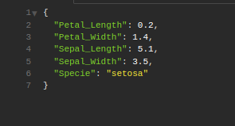
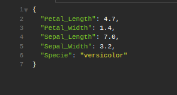

# neural-network-api
A Flask API consuming a neural network model.

**Description**

  This is an API project in Flask used to communicate with a neural network model to classify types of flowers from the iris dataset, from the scikit-learn library, classifying into Setosa, Versicolor or Virginica.

  NOTE: 'neuralnetwork' folder used to train the model. The model is a Multilayer Perceptron for classification with 100 hidden layer neurons, ReLU activation function, four input neurons and one output neuron.

**Installation instructions**

**SYSTEM REQUIREMENTS**

* Python 3.10

**Application installation**

1. Enter the backend folder
2. Run `pip install -r requirements.txt` to install the dependencies
3. Run `flask run` to run API

**Screenshots**

* Training the neural network.

* Response on `POST /iris {
	"Petal_Length": 0.2,
	"Petal_Width": 1.4,
	"Sepal_Length": 5.1,
	"Sepal_Width": 3.5
}`

* Response on `POST /iris {
	"Petal_Length": 4.7,
	"Petal_Width": 1.4,
	"Sepal_Length": 7.0,
	"Sepal_Width": 3.2
}`

* Response on `POST /iris {
	"Petal_Length": 6.0,
	"Petal_Width": 1.4,
	"Sepal_Length": 6.3,
	"Sepal_Width": 3.3
}`

