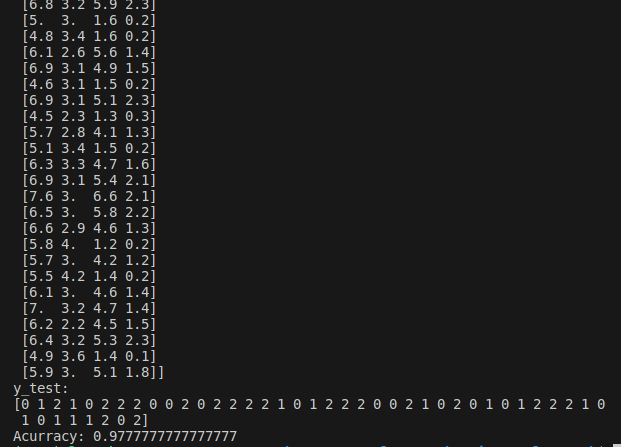

# neural-network-api
A Flask API consuming a neural network model.

**Description**

  This is an API project in Flask used to communicate with a neural network model to classify types of flowers from the iris dataset, from the scikit-learn library, classifying into Iris Setosa, Versicolour or Virginica based on the features.

**Installation instructions**

**Application installation**

1. Enter the API folder
2. Run `pip install -r requirements.txt` to install the dependencies,

**Screenshots**

* YYYY
